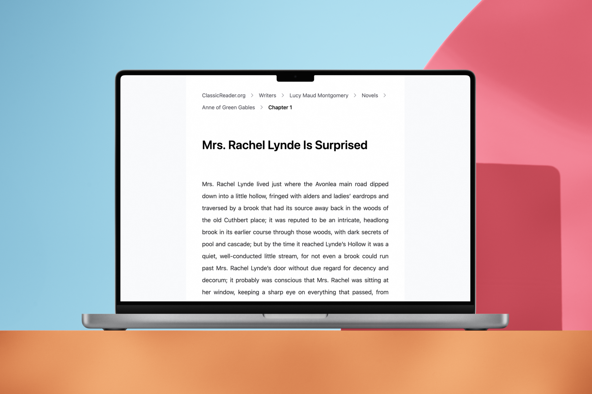

# [ClassicReader.org](https://classicreader.org)

A site for reading classic literature in the browser.

-  UX focused
-  SEO optimised
-  Minimal design
-  1,450 statically generated pages (as of 20 March 2025)

For more details about this project, please see the [project write-up](https://danedwardsdeveloper.com/projects/classic-reader) on my portfolio site.

## Tech Stack

-  [Next.js 15 App router](https://nextjs.org/)
-  [Tailwind](https://tailwindcss.com/)
-  [epub](https://www.npmjs.com/package/epub) e-book parser
